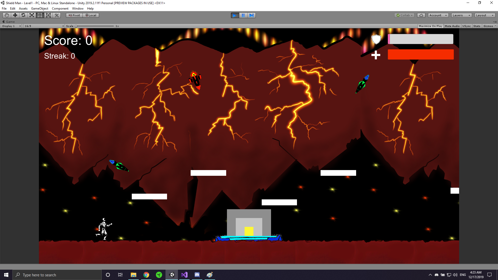

Tools and Skills:
 - Unity
 - C#
 - Game Development

 [Github Link](https://github.com/larrythexu/shieldman)

 ---

A collaborative game development project done in Tufts
CS-0023 class. I was the main creator of the game 
concept and one of the developers of the game.

