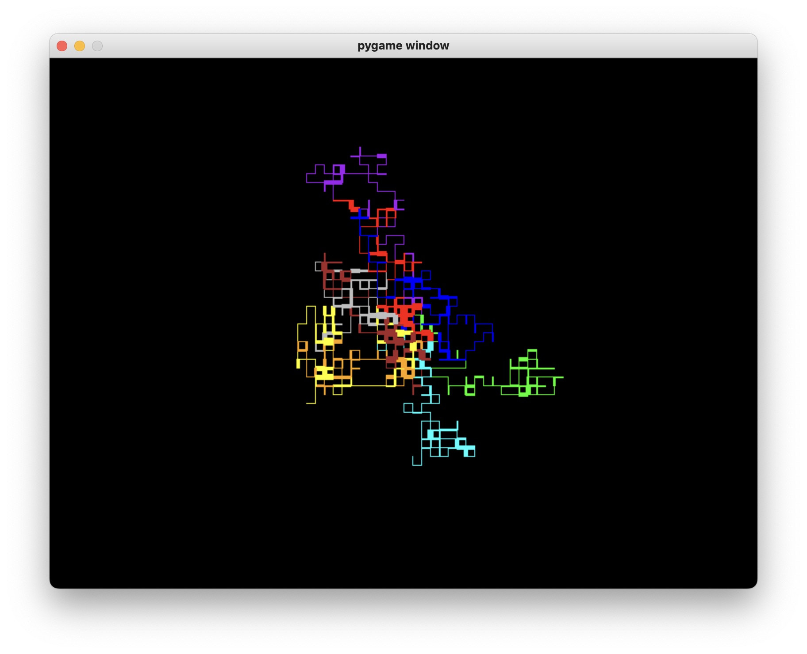

Tools and Skills:
 - Python (PyGame)

[Github Link](https://github.com/larrythexu/pywalk)

---

I recently saw a [video](https://www.youtube.com/watch?v=ErA4U9WqNCE)
of someone making a walking simulator in C. It looked pretty 
interesting to me so I wanted to give it a go in Python.

Since most of my work in Python has been in writing scripts or 
servers, and frameworks, this would've been something different. 
After some quick research, it looked like PyGame was the right
library to use. I spun it up pretty quick and was pleasantly 
surprised by how nicely and intuitive it worked. 

It's definitely very basic and probably not optimized. Perhaps 
me in another day will figure out when to work on that. One 
thing that could use changing is how each walker/path is 
stored. Another is possible walking directions (for now it's
only up, down, left, right). 

