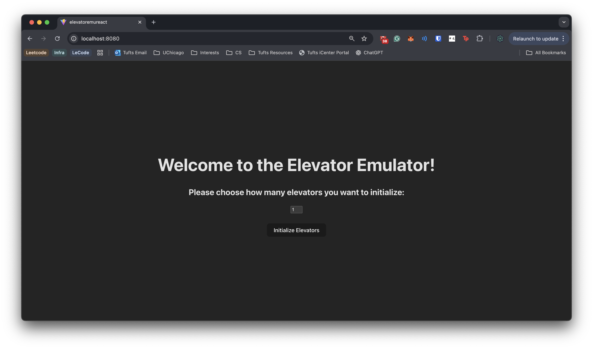
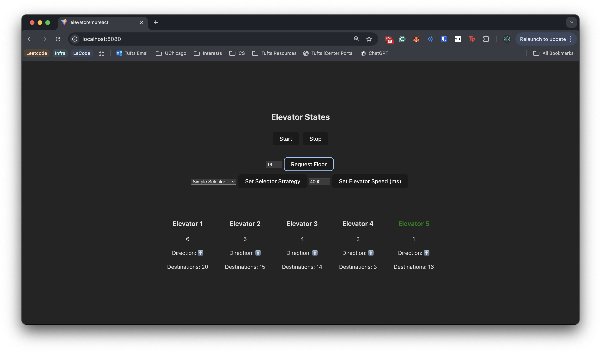

Tools and Skills:
 - Java
 - Spring Boot
 - REST API
 - WebSockets
 - React
 - TypeScript
 - HTML, CSS

 [Github Link](https://github.com/larrythexu/SpringElevator)

 ---
**Aug 15, 2025**

Whenever I've waited a second too long for an elevator, I always found myself wondering how the software worked. What better way to explore than to try and emulate it myself. ~~It is currently still IN THE WORKS~~. Version 1.0.0 is out!

I opted to use Spring Boot because of my experience with it, how much already is set up when creating the project, and the swappable beans - in case I wanted to change the selection algorithm for my elevators.

As of right now, the elevator logic and API is implemented. Users can request floors to a floor manager, which then picks an elevator. The elevators registered in the system will move floor-by-floor, dropping off on any of their target destinations. I even took the time to write a bunch of unit tests. 

I did have to explore websockets, which is something I've never worked with. I obviously didn't want to continually send requests for elevator states if I wanted a front-end to keep track of the elevators. I actually wasn't aware of how else it was done, so this was enlightening to learn.

I plan to add more algorithms to see more of a selection variety. There also needs to be a front-end... *gulp*

The Elevator Manager Controller:

@RestController
@AllArgsConstructor
public class ElevatorManagerController {

  private final ElevatorManager elevatorManager;

  @GetMapping("/elevators/{id}")
  public Elevator getElevator(@PathVariable("id") int id) {
    return elevatorManager.getElevator(id);
  }

  @GetMapping("/elevators")
  public List<Elevator> getElevators() {
    return elevatorManager.getAllElevators();
  }
  /** more stuff below **/
}


**Dec 18, 2025 UPDATE**

I finally got around to creating a second selection strategy (as a separate bean) AND a React frontend!
The styling is very, VERY basic (straight-out-of-the-vite-box basic), but it properly interacts with the 
backend server and displays the proper elevator state information.

With the 2nd selection strategy, you can hot-swap it mid-emulation. The second strategy chooses based off of 
the distance and same direction. So it will opt to choose the elevator that's closest and heading in the same 
direction (or neutral). 

Connecting the React webapp with the WebSockets was also something interesting to learn. This helped clarify
my understanding of the exact protocol my Spring Boot app uses for WebSockets: that being STOMP. It didn't 
really register to me that this was built on top of WebSocket API. I only realized this when I had to 
set up the STOMP client when connecting the frontend. I could've also used SockJS to help out with browsers
that don't work with WebSockets, but I figured this was overkill.

I ended up building the frontend, putting those files into Spring and having it serve it up statically.

Lastly, I've made a Dockerfile for it and uploaded it to DockerHub. So it can be run that way too!
Anyways, this was very fun to finally come back to and clean up.

I'm not completely done yet though. There's room to iterate and improve on the selection strategy.
The Proximity selection strategy has one fatal flaw, where even if an elevator has X number of floors in
its queue, if it's facing the right direction and closer to the target floor, the selector will choose it.
This can create a blockage in the queue, where elevator1 gets assigned 5 floors and elevator2 gets none.
I'm thinking that an improved proximity selector would add weighting based on an elevator's number of queued
floors.

