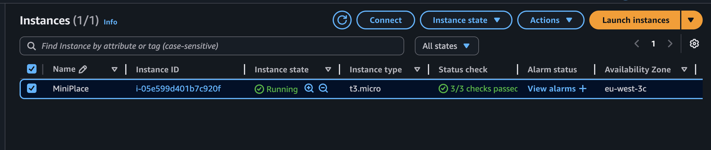
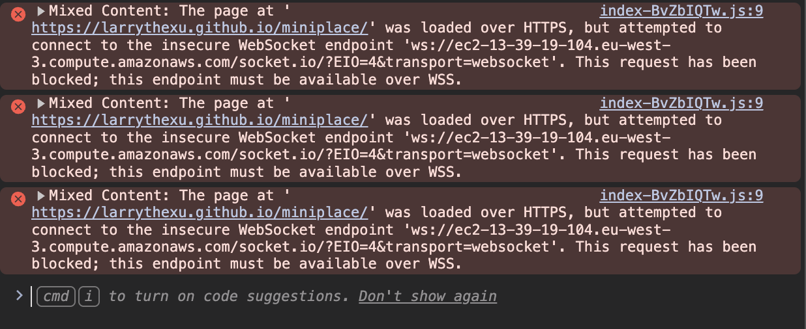

Tools and Skills:
 - Flask
 - Gunicorn
 - WebSockets (SocketIO)
 - AWS (EC2)
 - React
 - TypeScript
 - Python

[Github Link](https://github.com/larrythexu/miniplace)

[MiniPlace](http://ec2-13-39-19-104.eu-west-3.compute.amazonaws.com) (I'm not sure how long I'll be keeping it up)

---

This was my second exploration of WebSockets, but this time,
in the realm of Python and React, using SocketIO. I was inspired 
by [OCMB](https://eieio.games/blog/scaling-one-million-checkboxes/),
and wanted to create something similar. Not only this, but I 
could also explore setting up a backend server in the CLOUD. I
knew of AWS Cloud, but I never actually hosted or set something up
there, so this was a perfect chance.

**Local Setup**

Using Flask and SocketIO, I set up the server to hold an 
uint8 array with 10000 indexes. I wanted it to hold 3 values
(that being RGB) instead of the binary 2, which is seen in 
OCMB. This would still keep the broadcasted data small, in my 
eyes. 

The backend was designed to emit the board state via SocketIO
every 5 seconds. Any listeners, those being frontend clients, would 
listen to the "update" topic and interpret the array, adjusting 
how the MiniPlace board looked based on the number in the array.
Like in OMCB, I also integrated react-window so the browser 
wasn't rendering ALL cells every time. 

I decided to use eventlet to handle the background process of 
emitting. From what I researched, this was recommended as opposed 
to having a Python thread do this.

I was able to get this up and running pretty quickly. 
Locally, it seemed very smooth!

But I wanted to go beyond just this. Make it a legitimate server.
Flask's built-in server is not built for prod, typically only used 
for local builds and testing. To upgrade, we need to use Gunicorn,
which should be better suited for prod-level traffic (even though
I probably wouldn't run into it). 

**Upgrading to REAL Server**

I installed Gunicorn, setup a wsgi.py page (finally got me 
to understand what a WSGI was and the purpose of those files).
Lastly, I created the dockerfile and pushed the image up to
my Dockerhub repo.

Next step was to try and move this to a real server. My initial
plan was to figure out AWS and just leave the backend there on an 
EC2 instance (my AWS knowledge was pretty limited to EC2 being for
that). I figured I could also just host the frontend in Github
Pages. The intent was to have a clear separation between the 
frontend and backend. Only later would I find out this to be a 
mistake.

So I went about learning and setting things up in AWS. I 
created an account there and started an EC2 instance - using an 
Ubuntu t2.micro server. I SSH'd in and pulled the docker 
image.

The backend server/docker image wasn't equipped to just be 
run straight out of the box, as that wouldn't have been safe. So 
came time to learn Nginx and reverse proxying!

I installed nginx and created the config file. Then proceeded 
to test and load it. But there came my first issue: the public
IP/URL wasn't working! It displayed the default nginx page,
but any calls to the /api gave me a 404 Error. 

I was confused, because performing curl to 127.0.0.1:8000/api
worked as expected, so something was definitely not working on 
the nginx side. Took me a while, but I realized it really 
came down to just deleting the default config file...
I guess that step wasn't really that obvious to me.

Deleting it caused nginx to use the actual config file I 
had created. And testing the public IP yielded what I wanted!
My backend server was finally working as expected!

**Connecting the frontend**
As according to my original plan, I wanted Github pages to host
my frontend. My EC2 instance was setup to only allow SSH and 
HTTP inbound (I didn't want to bother setting up HTTPS right 
now). So I assumed I could force my frontend to send HTTP 
requests and use WS rather than WSS. 

So I setup a Github actions workflow and readied up Github pages.
Only to see this:

So Github Pages forces HTTPS and WSS. I should've known.

**Moving the frontend**
After all this work, I decided I might as well just put the 
frontend into my EC2 instance and have nginx serve it.
It would simplify things. 

So I built the page and configured nginx to serve it! And 
fortunately, it was up and running! 

Absolutely a rewarding experience to see working. There's
also so much to learn about nginx. So I'll be making sure 
to do more reaserch on that.
